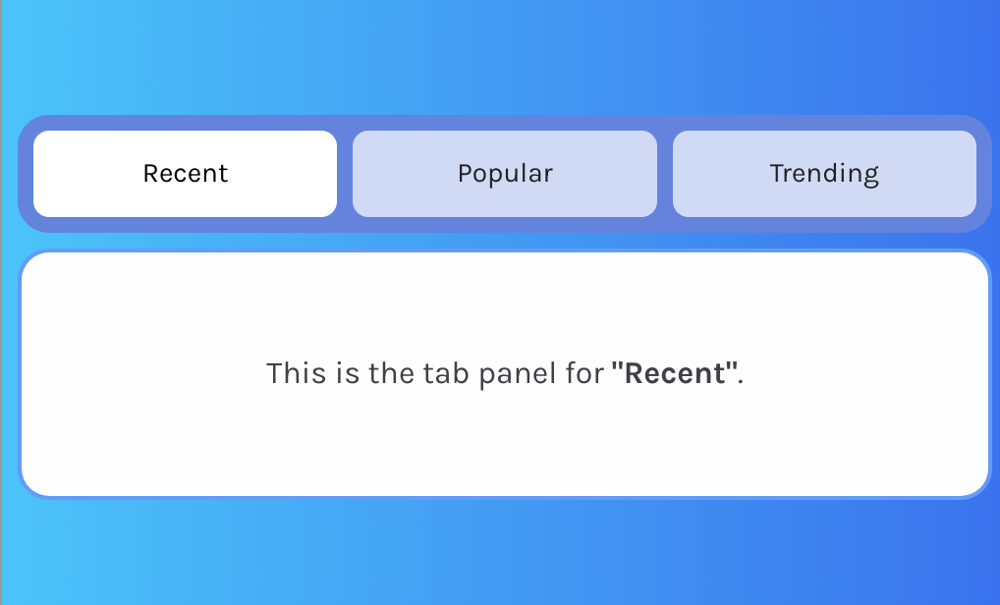
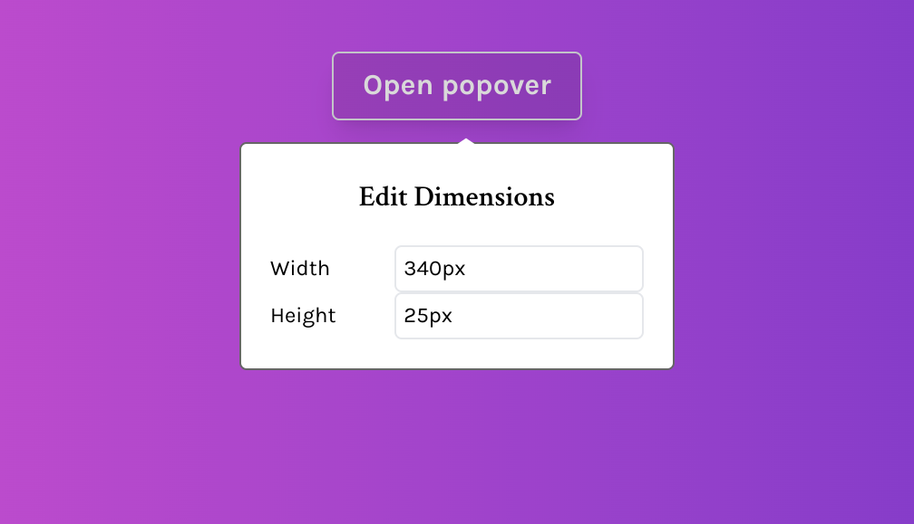
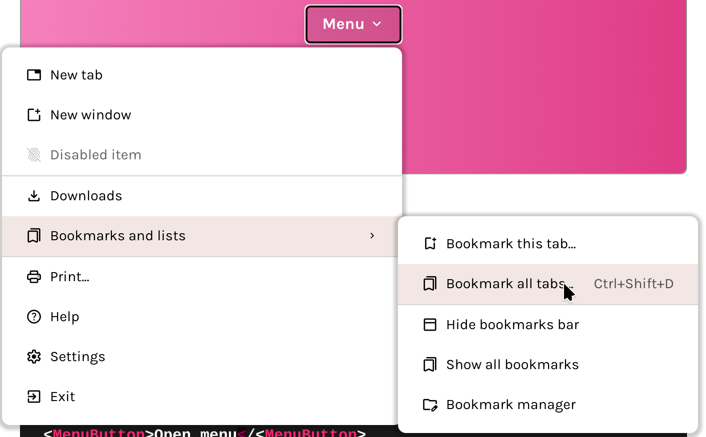
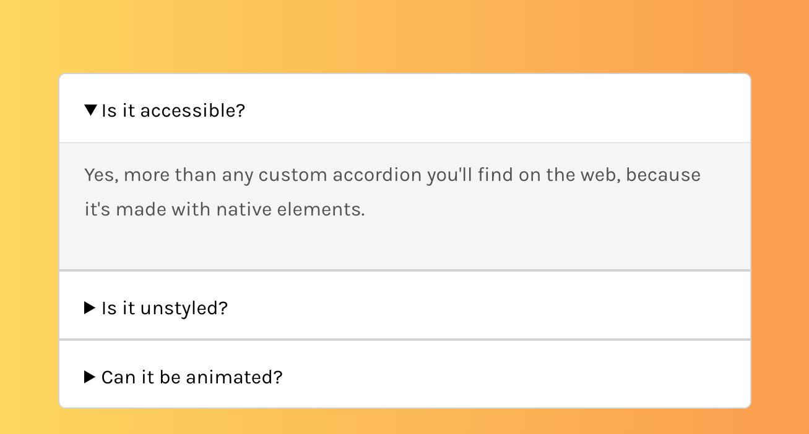
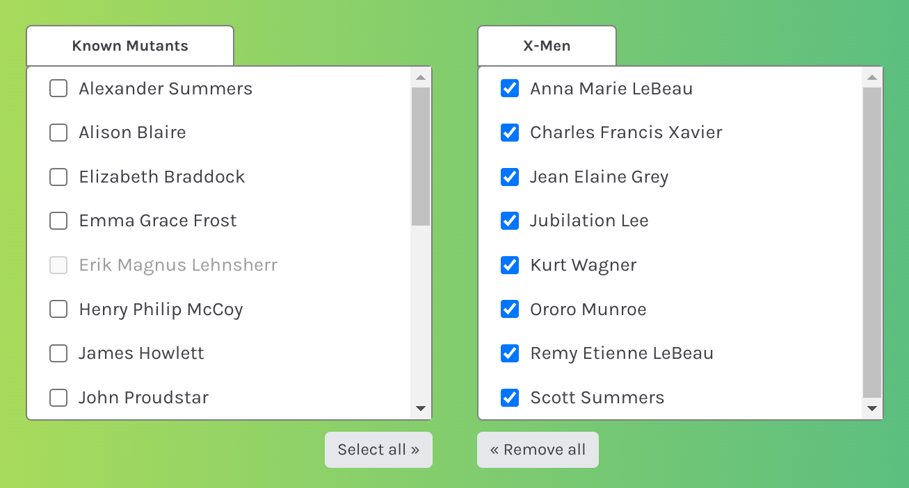
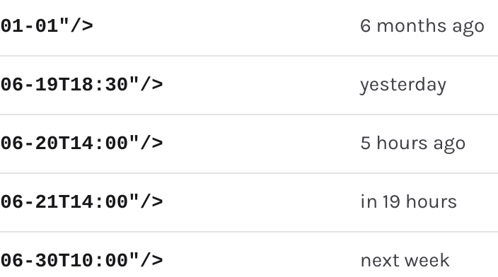

# JinjaX-UI

Accessible UI components, to integrate with your [JinjaX](https://github.com/jpsca/jinjax) projects.

**Documentation:** https://jinjax.scaletti.dev/ui/

|                                                                                |                                                                                   |                                                                          |
| ------------------------------------------------------------------------------ | ----------------------------------------------------------------------------------| ------------------------------------------------------------------------ |
|                 |           |           |
|  |  |  |

## Roadmap

It is pitch black. You are likely to be eaten by a grue.
